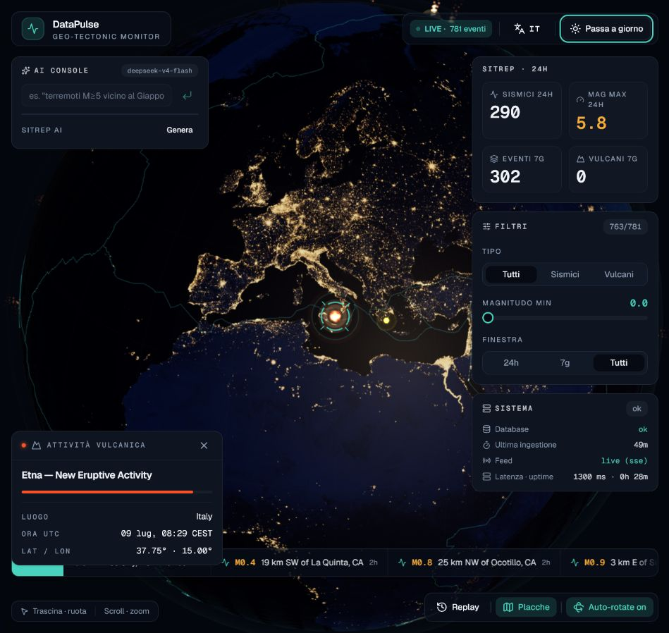

# DataPulse

[](https://github.com/MarioSambataro/DataPulse/actions/workflows/ci.yml)
[](https://github.com/MarioSambataro/DataPulse/actions/workflows/etl-earthquakes.yml)
[](https://github.com/MarioSambataro/DataPulse/actions/workflows/etl-volcanoes.yml)

[Live demo](https://data-pulse-tau.vercel.app) ·
[API status](https://datapulse-api-09py.onrender.com/status) ·
[Swagger](https://datapulse-api-09py.onrender.com/docs)

Console web di monitoraggio geotettonico che unifica terremoti USGS e attività
vulcanica Smithsonian GVP in un globo 3D interattivo, con feed live, filtri
geospaziali, replay temporale e osservabilità dell'intera pipeline.



## Cosa dimostra

- pipeline ETL multi-sorgente, idempotente e schedulata;
- modellazione unificata di eventi sismici e vulcanici;
- query geospaziali PostGIS tramite FastAPI e SQLAlchemy;
- streaming Server-Sent Events con fallback polling;
- rendering WebGL con Three.js e marker instanziati;
- replay temporale, deep-link agli eventi e modalità giorno/notte;
- query in linguaggio naturale e briefing AI opzionali;
- health, readiness, metriche Prometheus, cache HTTP e rate limiting;
- test unitari, integrazione PostGIS ed E2E Playwright.

## Architettura

```text
USGS Earthquake API ─┐
                     ├─► GitHub Actions ETL ─► Neon PostgreSQL + PostGIS
Smithsonian GVP RSS ─┘                              │
                                                   ▼
                                           FastAPI su Render
                                      REST · SSE · Prometheus · AI
                                                   │
                                                   ▼
                                      React + Three.js su Vercel
```

Il frontend non usa dati hard-coded in produzione: API, statistiche, stato del
sistema e feed SSE provengono dal backend. `?mock=1` è disponibile esclusivamente
per screenshot e test E2E indipendenti dall'infrastruttura cloud.

## Funzionalità principali

- **Globo 3D:** texture giorno/notte, atmosfera, placche tettoniche e camera animata.
- **Eventi live:** terremoti e vulcani con severità, hover, selezione e ticker.
- **Analisi:** filtri per tipo, magnitudo e finestra temporale; statistiche 24h/7g.
- **Time travel:** replay degli eventi con playhead e velocità configurabile.
- **Affidabilità:** retry del cold start, ETag/cache, rate limit e stato di ingestione.
- **Accessibilità:** tema motion-reduced, controlli ARIA e duplicati visuali esclusi dal focus.
- **Internazionalizzazione:** interfaccia italiana e inglese.

## Stack

| Layer | Tecnologie |
|---|---|
| Frontend | React, TypeScript, Vite, Three.js, react-three-fiber, Zustand |
| Backend | FastAPI, Pydantic, SQLAlchemy, SSE, Prometheus |
| Data | PostgreSQL, PostGIS, Alembic, pandas |
| Ingestion | USGS GeoJSON, Smithsonian GVP RSS, GitHub Actions |
| Quality | Ruff, Pytest, Vitest, ESLint, Playwright |
| Deploy | Neon, Render Docker, Vercel |

## Avvio locale

Prerequisiti: Docker, Node.js 20+ e Python 3.12+.

```bash
cp .env.example .env
docker compose up -d postgres api

cd web
npm install
npm run dev
```

- Dashboard: `http://localhost:5173`
- API: `http://localhost:8000`
- Swagger: `http://localhost:8000/docs`
- Health: `http://localhost:8000/health`

## Test

```bash
# Frontend
cd web
npm run lint
npm run test
npm run build
npm run e2e

# Backend, con Python 3.12 e PostGIS disponibili
ruff check .
pytest
```

La CI replica i controlli backend contro un servizio PostGIS reale e pubblica il
report Playwright come artefatto in caso di errore.

## Deploy

La procedura gratuita completa usa Neon per il database persistente, Render per
l'API Docker, Vercel per il frontend e GitHub Actions per gli ETL.

Consulta [docs/DEPLOY.md](docs/DEPLOY.md) per configurazione dei secret, migrazioni,
CORS, popolamento iniziale e verifica end-to-end.

## Fonti dati e asset

- [USGS Earthquake Catalog API](https://earthquake.usgs.gov/fdsnws/event/1/)
- [Smithsonian Global Volcanism Program](https://volcano.si.edu/)
- texture terrestri NASA in pubblico dominio; attribuzioni in
  [web/public/textures/README.md](web/public/textures/README.md)

I dati rappresentano una visualizzazione informativa e non sostituiscono i
bollettini ufficiali di protezione civile o degli enti scientifici competenti.
